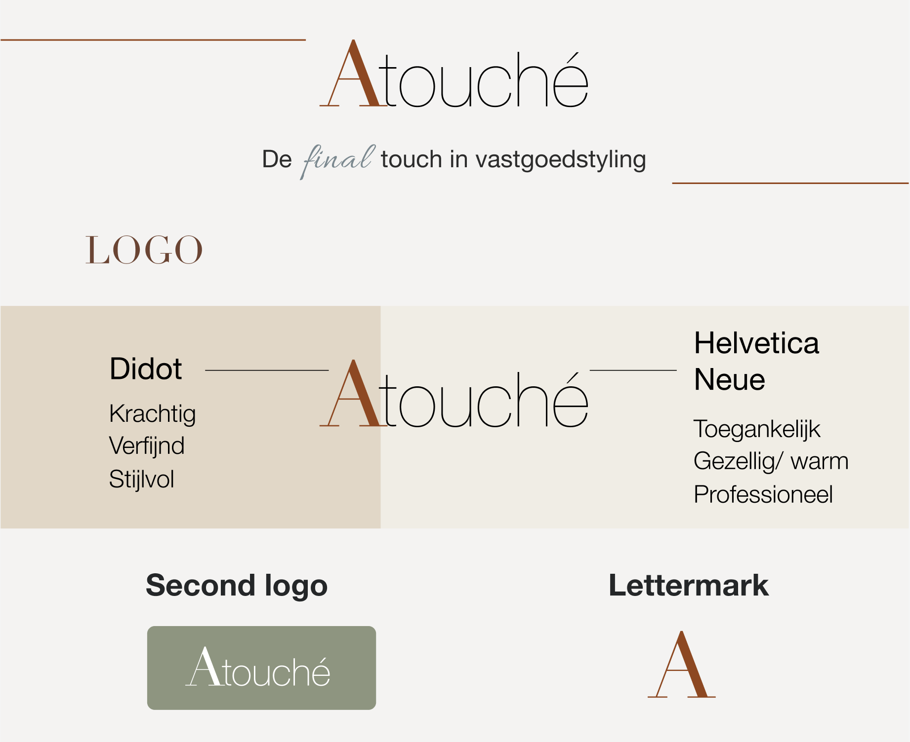
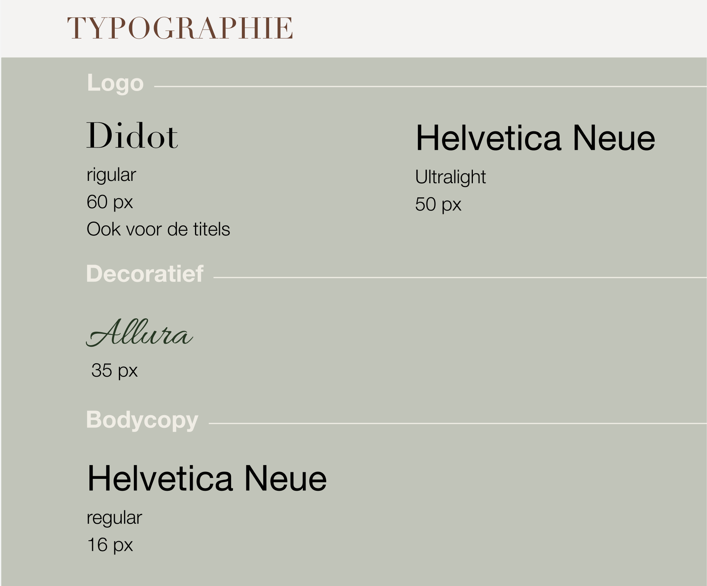
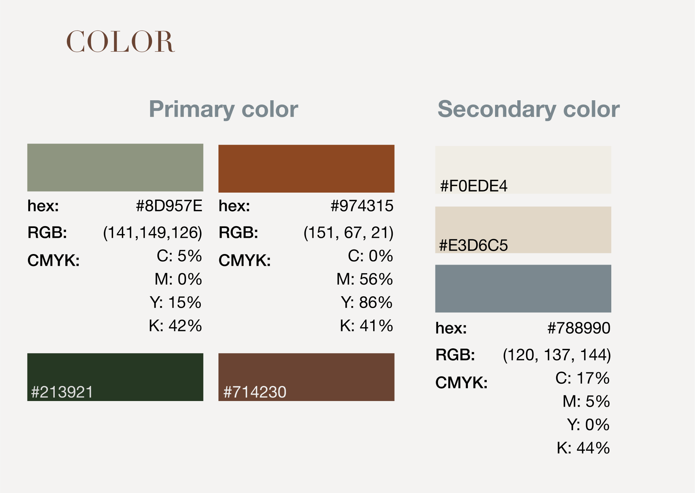
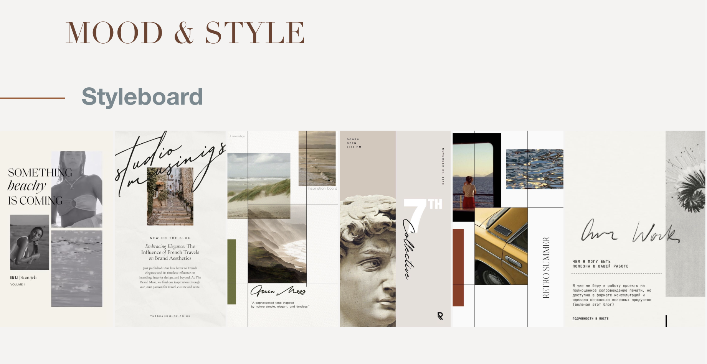
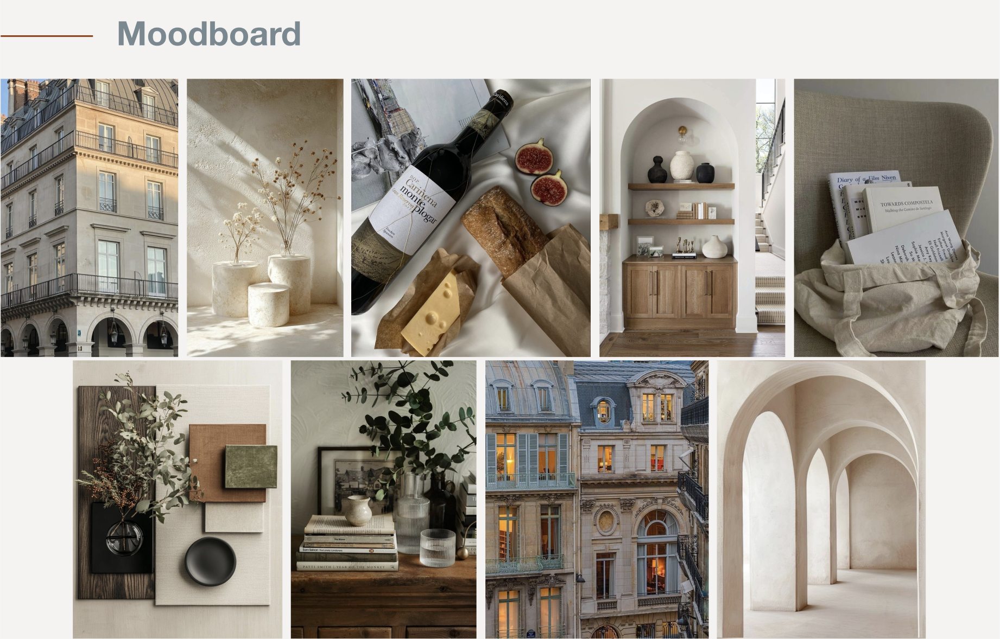

Atouche is a real estate styling partner that presents properties optimally. With style, flair, and expertise, it ensures that spaces sell faster and at a better price. The style is professional, approachable, and warm, with an intricate yet fresh look – suitable for private homes as well as real estate projects.

<a href="https://www.figma.com/proto/BTWMhhUhx11klsCIab4asI/Atouch%C3%A9?node-id=69-216&viewport=284%2C181%2C0.47&t=HkSBBU3IeGCMOoqU-1&scaling=min-zoom&content-scaling=fixed&page-id=69%3A215" class="project__figma">Figma file</a>

