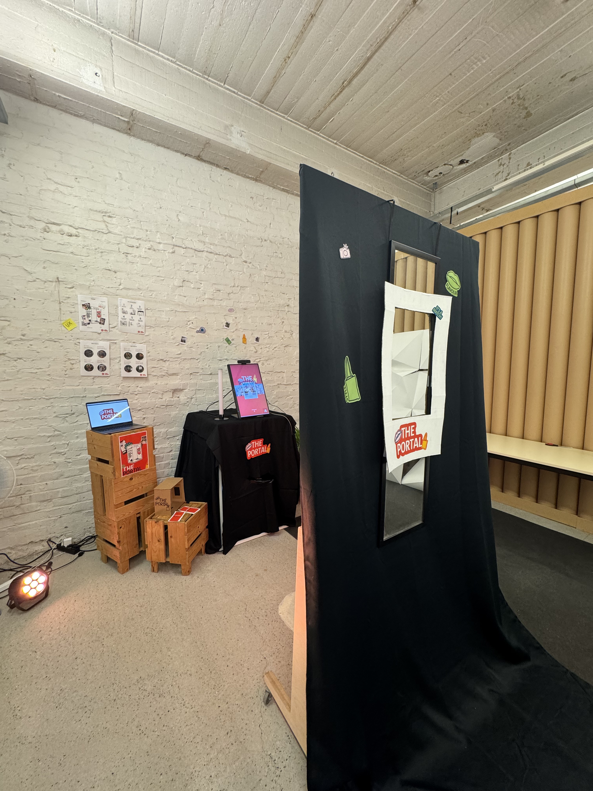
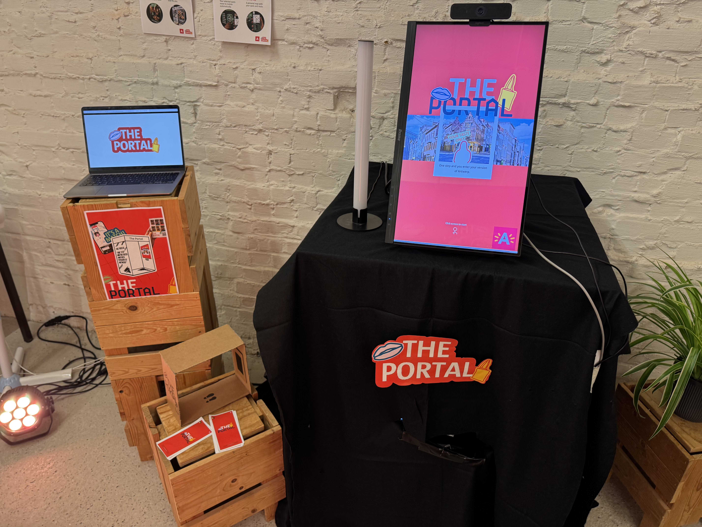
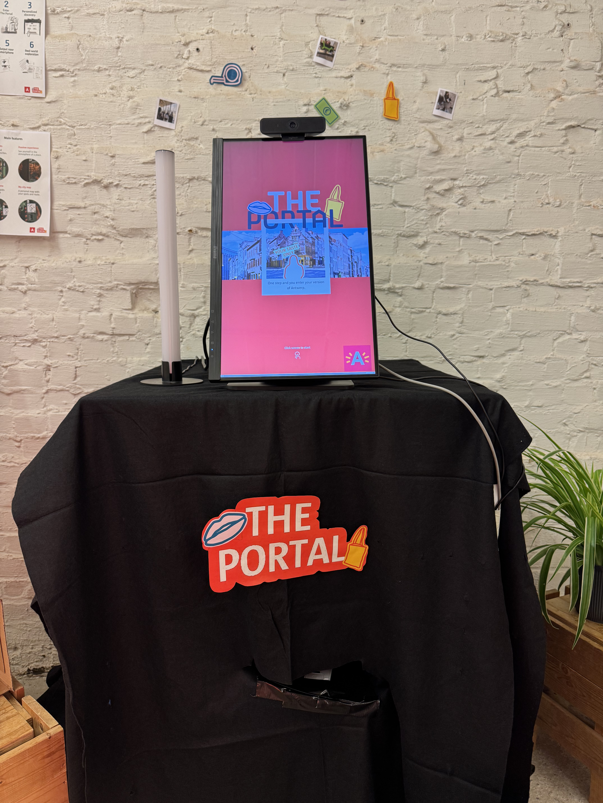

For this project, we collaborated with Visit Antwerp to create a digital-first experience that encourages young urban travellers (18 to 36 years old) to choose Antwerp as their next city trip destination.

The challenge was to move away from traditional city marketing and create an authentic, personal experience that connects with the mindset of Millennials. The goal was to show Antwerp beyond its well-known landmarks by focusing on hidden experiences, local communities, and personal interests.

Our design challenge became:

How might we help Zillennials experience Antwerp through their own identity (flavour and style), using local communities and flexible discovery to reveal the taste of the city beyond the tourist perspective?

 
 Concept 
 
"One step and you enter your version of Antwerp."

The Portal is a physical and digital experience that helps Zillennials discover a more personal and hidden side of Antwerp based on their own interests in Style and Flavour.

The concept responds to the insight that many young travellers already visit Antwerp, but often leave after a short visit because they only discover the well-known places. The Portal creates a second dreaming phase during their visit by inspiring them to explore more of the city and discover places that match their identity.

Visitors enter a walk-in installation where they select their preferences. Based on their choices, The Portal recommends curated local spots and experiences that fit their personal taste. Users can save their favourite locations and receive a personalised map through QR to continue exploring Antwerp.

Rather than providing an exhaustive list of recommendations, The Portal offers a curated selection that acts as a starting point for exploration. By leaving room for discovery, visitors are encouraged to explore beyond the suggested spots and find other places throughout Antwerp that spark their interest.

For people who have not visited Antwerp yet, an online campaign creates curiosity around The Portal and the hidden side of the city, encouraging them to plan their next visit.

<a class= "see-button" href="https://www.behance.net/gallery/251194535/The-Portal" class="project__figma">Visit UX-website</a>

 
 Local & Online Connection 
 
The Portal runs locally on the installation screen, allowing the interactive experience and printing process to work directly on the device. The web app, however, is deployed online through GitHub Pages, so users can access their personalised results on their phone.

The local Portal and online web app are connected through Supabase. When a visitor completes the Portal, their selections are stored in the database and a unique QR code is generated. Scanning the QR code opens the online web app and retrieves their personalised locations, allowing them to continue exploring Antwerp on their own device.

<a class= "see-button" href="https://github.com/MargotRopcke/integration4" class="project__figma">Visit github file</a>

<a class= "see-button" href="https://www.figma.com/proto/mpJdmvMZZ3YsKBAPYG6O1x/INT4?node-id=5041-20141&viewport=499%2C368%2C0.04&t=UeoJEOEeBzdYL8MM-1&scaling=min-zoom&content-scaling=fixed&starting-point-node-id=5041%3A20141&show-proto-sidebar=1&page-id=5041%3A18339
" class="project__figma">Prototype The Portal</a>

<a class= "see-button" href="https://www.figma.com/proto/mpJdmvMZZ3YsKBAPYG6O1x/INT4?node-id=5041-18924&viewport=-1063%2C147%2C0.11&t=f9EyIhTgyxXCpzYE-1&scaling=min-zoom&content-scaling=fixed&starting-point-node-id=5041%3A18924&show-proto-sidebar=1&page-id=5041%3A18339
" class="project__figma">Prototype mobile</a>

