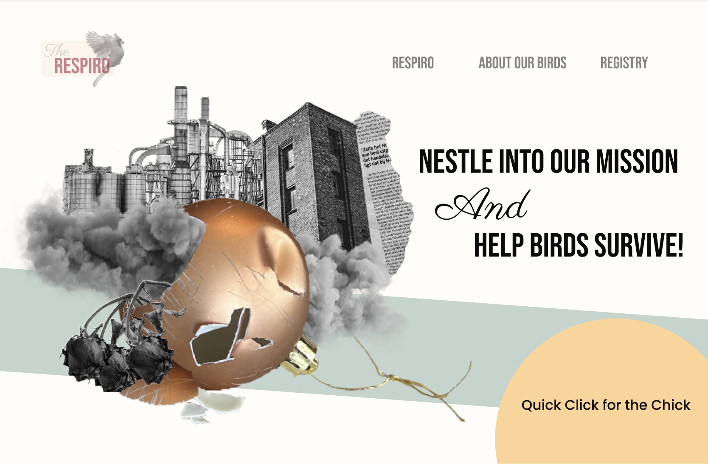
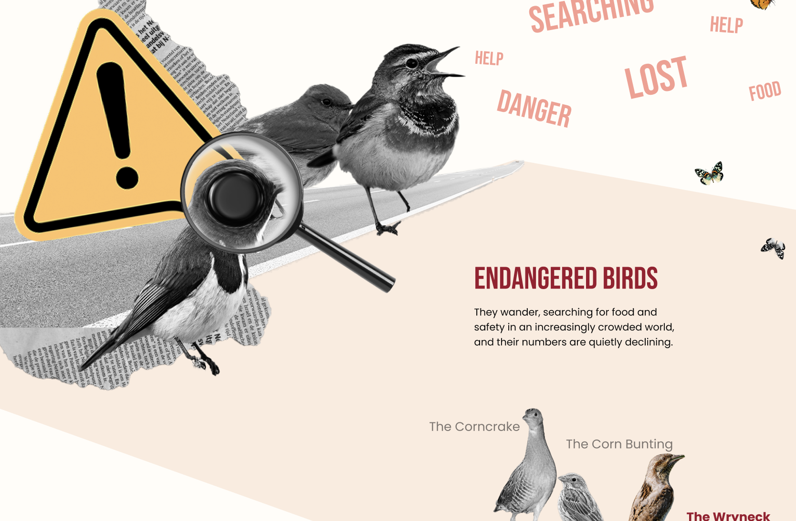
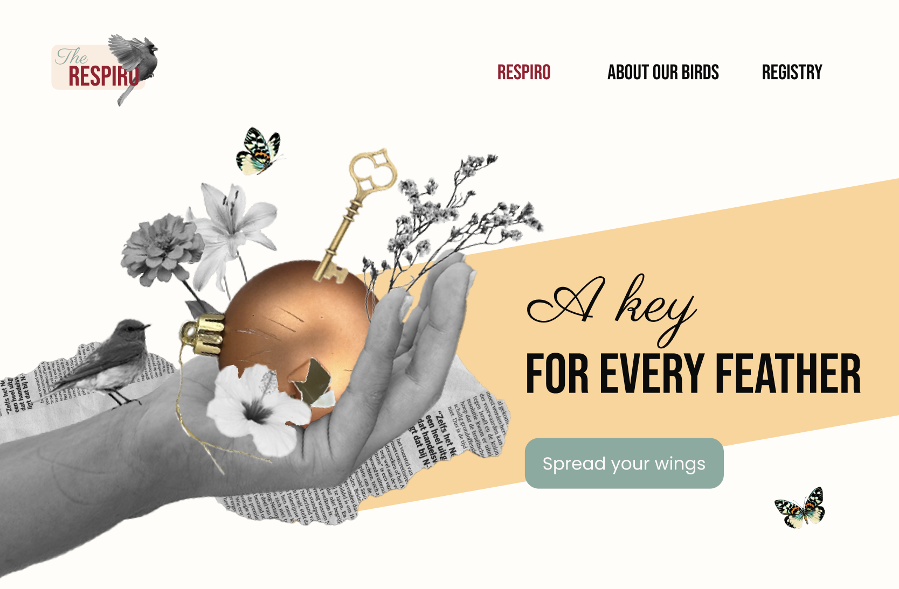

A website where a worthless object is transformed into a new, usable object, inspired by endangered bird species. The goal is creative reuse and creation centered on nature conservation.

<a class="visit" href="https://moodsave.be/int2/" class="project__figma">Visit website</a>

