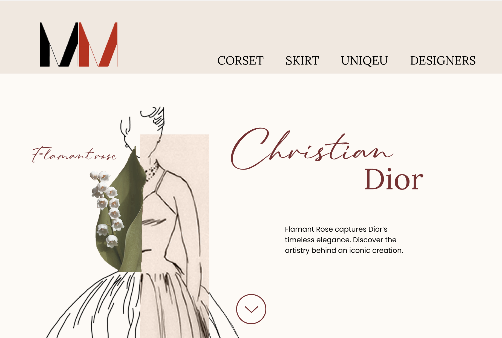

 The Dior assignment, I am working around the Fashion Museum Antwerp (MoMu), where fashion is viewed as more than just clothing, but as a way to showcase stories and culture. I visit the museum and draw inspiration from the collection and exhibitions. Using these insights, I create a creative output aimed at an adult audience.

 <a class= "see-button" href="https://femke-d.github.io/integration3/" class="project__figma">Visit website</a>

 
 Concept 
 
 The concept starts from the inside out: the meaning and impact of a dress are shown through the design. The website focuses on features, the designer's choices, and the effect on women and society worldwide. The lily of the valley is subtly used as a symbol of hope.

 
