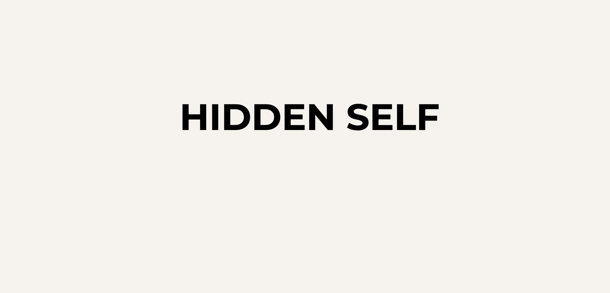
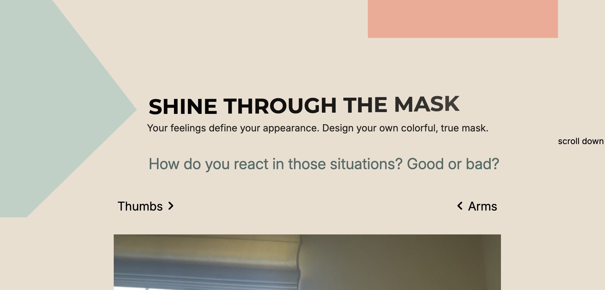
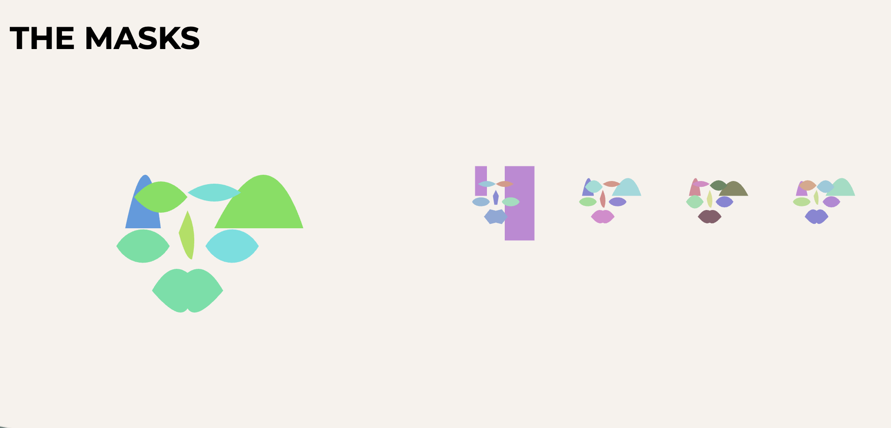

Hidden Self is an interactive experience about self-expression and authenticity. It invites users to reflect on who they truly are, beyond the masks they wear. Through dynamic animations and machine learning, the mask on the website evolves, showing how personal growth and letting go of the mask lead to freedom and self-acceptance.

<a class="visit" href="https://moodsave.be/hiddenself/" class="project__figma">Visit website</a>

