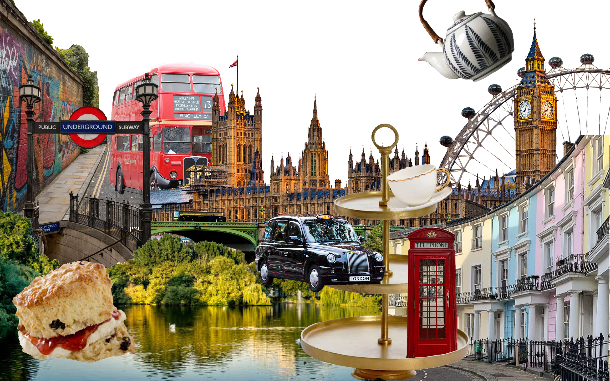
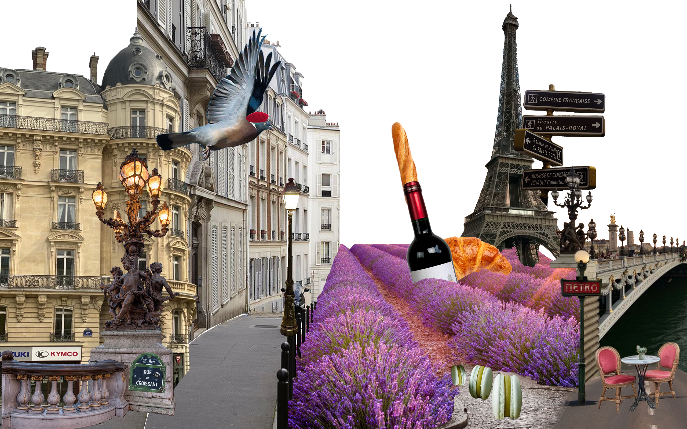
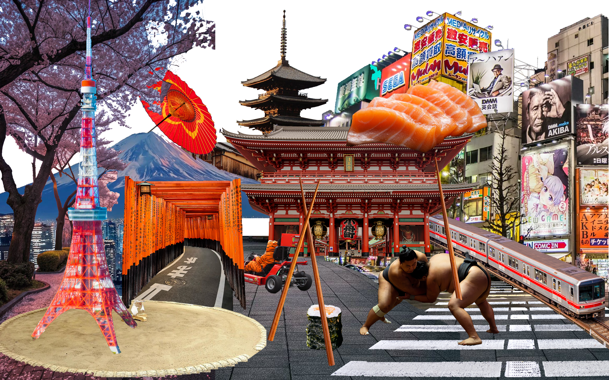

    <button class="switch-btn active" data-project="webrtc">WebRTC</button>
    <button class="switch-btn" data-project="arduino">Arduino</button>

<h2 class="second-titel subtitle">WebRTC</h2>

 
View and Influence Cities is an interactive experience in which users explore and transform a digital city. Movements and sound influence the city: tilting changes style or zoom, shaking distorts buildings, swiping and camera touch control day/night, and the microphone adjusts the crowding based on ambient sound.

<a class= "see-button" href="https://city-ilj6.onrender.com/" class="project__figma">Visit website</a>

<h2 class="second-titel subtitle">Arduino</h2>

 
I further developed Discovery Cities by creating a physical Arduino interface that connects with the digital city. The physical controls allow users to interact with and influence the city through movement, light and distance.
 
 
A rotary encoder controls the zoom in and out of the city, while a VL53L0X distance sensor allows users to select between different cities. A photoresistor detects the surrounding light level and controls the day/night cycle. Buttons control the cultural shock interaction and reset the experience.
 
 
The physical interactions are enhanced with a servo motor, RGB LED, LEDs and a passive buzzer, providing visual, audio and physical feedback. This extension combines the existing digital experience with physical interaction to create a more immersive way of exploring the cities.

