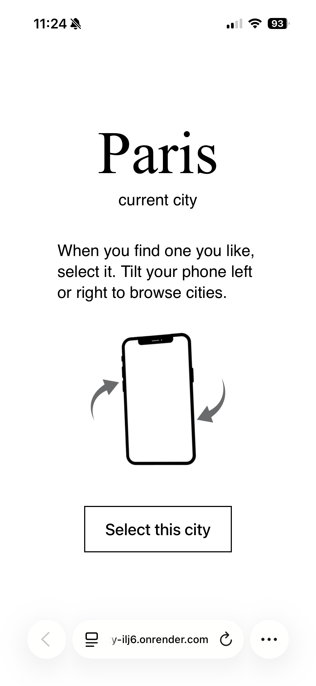
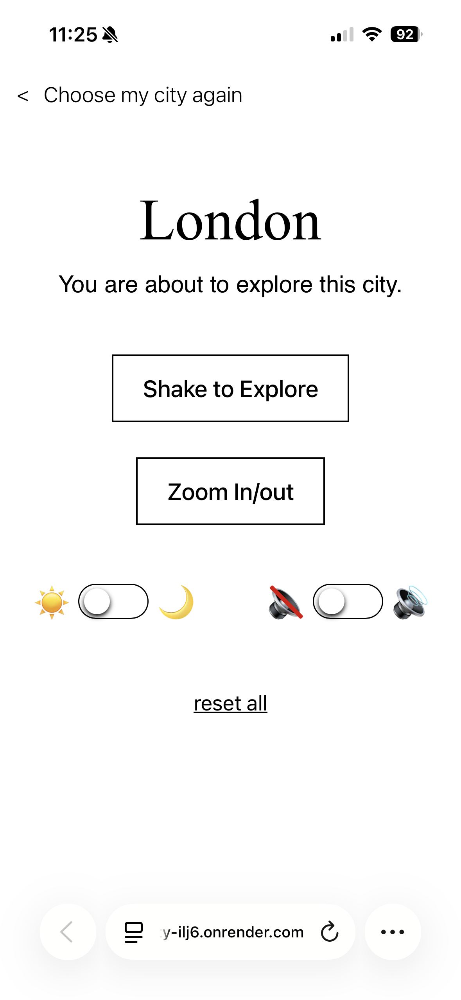

View and Influence Cities is an interactive experience in which users explore and transform a digital city. Movements and sound influence the city: tilting changes style or zoom, shaking distorts buildings, swiping and camera touch control day/night, and the microphone adjusts the crowding based on ambient sound.

<a class="visit" href="https://city-ilj6.onrender.com/" class="project__figma">Visit website</a>

